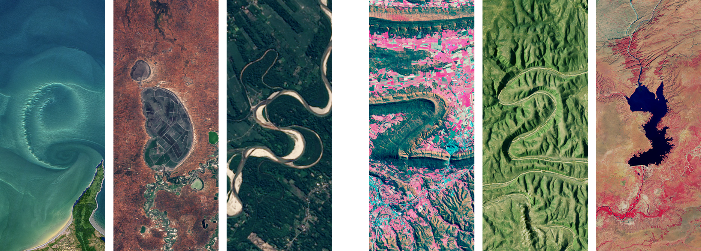

## Labs and Discussions for Geospatial Analysis & Remote Sensing 
Master of Environmental Data Science (MEDS) \
Fall 2026

### The Purpose of this Repository

This repository aims to showcase the labs and discussions that were completed in the MEDS EDS 223 course over the 2026 Fall Quarter. Here you will see the accumulation of work over a 10 week period and the progression of the skills that were learned.

### Package Dependencies

* `tidyverse` 

* `fs` 

### File Organization

"# run tree to find this"

### Data and File Information

**The Projects** completed in this courses usees data from these sources: 

### Authors and Current Contributors 

Author - [Ethan Mathews](https://github.com/ethan-mathews24)

Contributor - [Annie Adams](https://github.com/annieradams)

### Acknowledgements 

